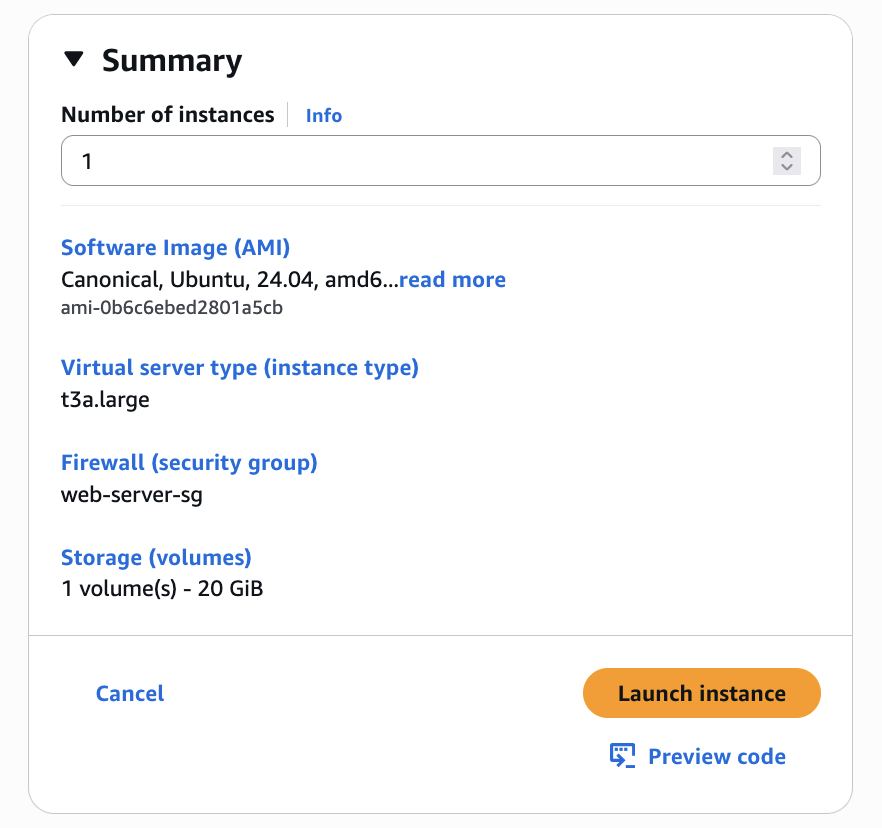
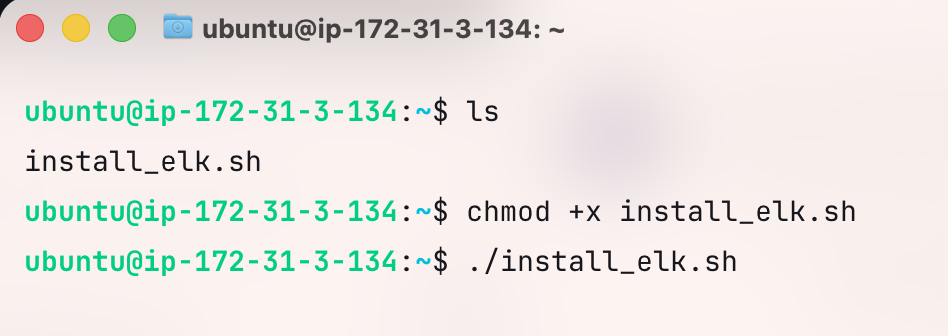
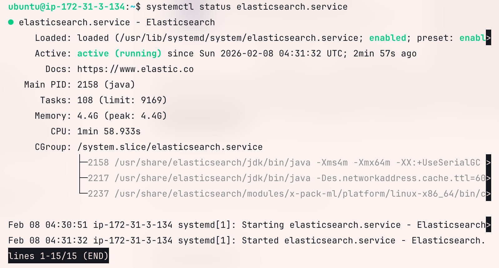
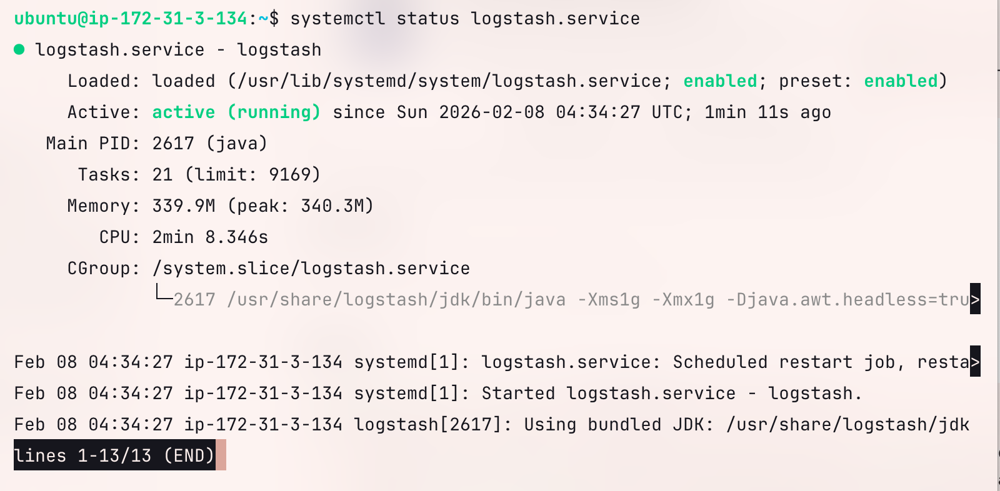
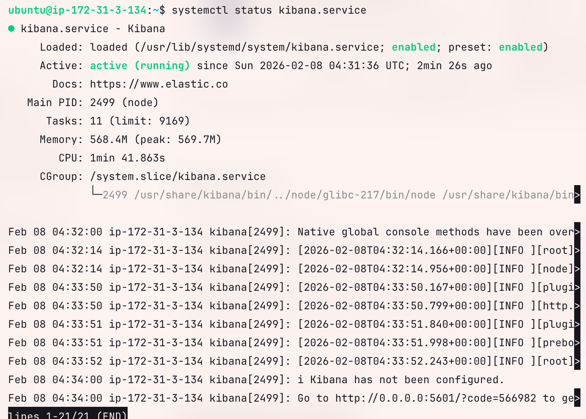
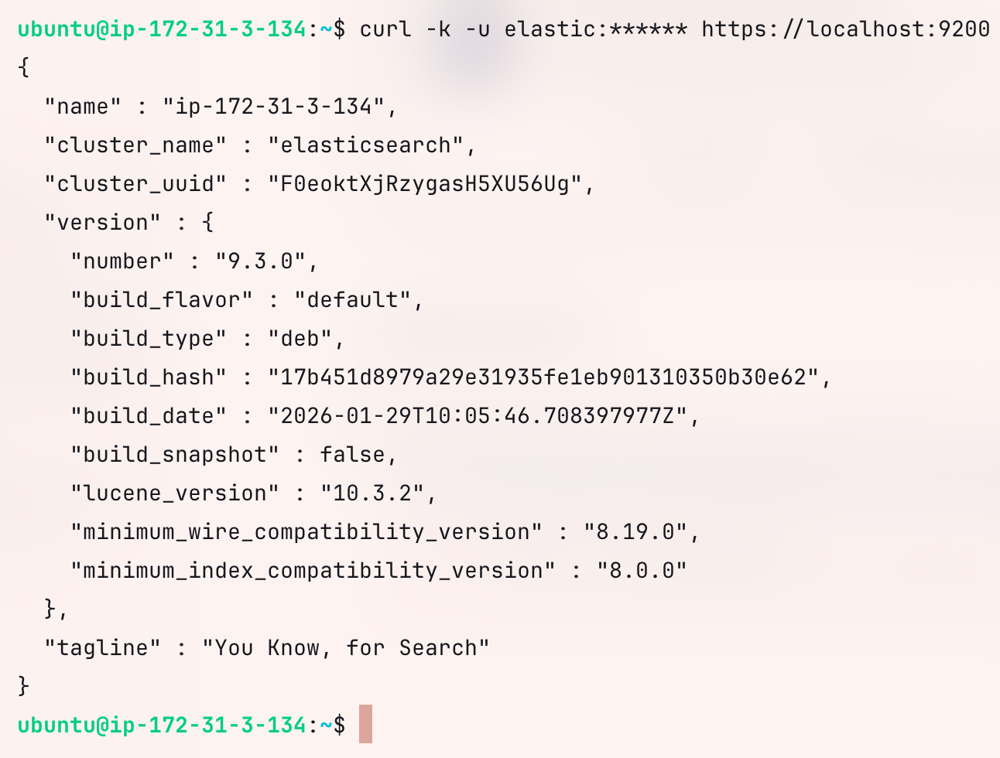
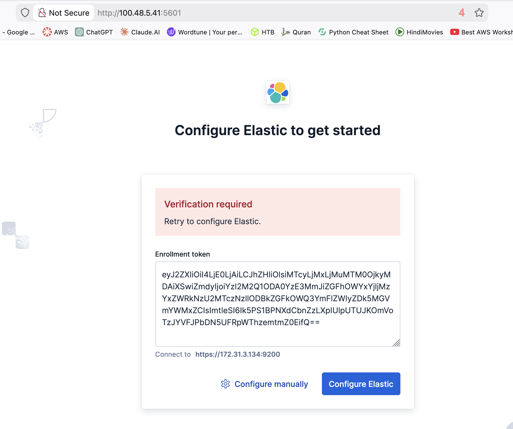

# ELK: Installation

**EC2 Basic Requirements** 

- At least 4GB RAM (8GB recommended)
- 2+ CPU cores

## 1. Create EC2



SG inbound rules


## 2.  Script to install ELK stack

install_elk.sh

```bash
#!/usr/bin/env bash
set -euo pipefail

echo "Installing Elastic Stack 9.x (Elasticsearch, Kibana, Logstash) ..."

# 1) prerequisites

sudo apt-get install -y wget gnupg apt-transport-https ca-certificates

# 2) add Elastic signing key (keyring)
wget -qO - https://artifacts.elastic.co/GPG-KEY-elasticsearch | sudo gpg --dearmor -o /usr/share/keyrings/elasticsearch-keyring.gpg

# 3) add Elastic repo (9.x)
echo "deb [signed-by=/usr/share/keyrings/elasticsearch-keyring.gpg] https://artifacts.elastic.co/packages/9.x/apt stable main" | sudo tee /etc/apt/sources.list.d/elastic-9.x.list

# 5) install Elastic components
sudo apt-get update -y && sudo apt-get install -y elasticsearch kibana logstash filebeat 

# 6) configure Kibana to listen on all interfaces
sudo sed -i.bak '/^[[:space:]]*#server\.host:[[:space:]]*"localhost"[[:space:]]*$/a server.host: 0.0.0.0' /etc/kibana/kibana.yml

# 7) enable + start services
sudo systemctl daemon-reload
sudo systemctl enable --now elasticsearch
sudo systemctl enable --now kibana
sudo systemctl enable --now logstash
sudo systemctl enable --now filebeat

sudo mkdir -p /etc/logstash/certs
sudo cp /etc/elasticsearch/certs/http_ca.crt /etc/logstash/certs/http_ca.crt
sudo chown root:logstash /etc/logstash/certs/http_ca.crt
sudo chmod 640 /etc/logstash/certs/http_ca.crt

sudo tee /etc/logstash/conf.d/test.conf >/dev/null <<'EOF'
input {
  stdin { }
}

output {
  elasticsearch {
    hosts => ["https://localhost:9200"]
    user => "elastic"
    password => "<password>"
    ssl_enabled => true
    ssl_certificate_authorities => "/etc/logstash/certs/http_ca.crt"
    index => "logstash-test-%{+YYYY.MM.dd}"
  }
  stdout { codec => rubydebug }
}
EOF

sudo systemctl restart kibana
sudo systemctl restart logstash

echo "Done."
```

<aside>
❗

No need to manually install jdk since Elastic stack 8+ it comes bundles with OpenJDK

</aside>

### Add execute permission and run the script



### ElasticSearch



### Logstash



### Kibana



## 3. Configuring  ElasticSearch

Resetting the userpassword

```
sudo /usr/share/elasticsearch/bin/elasticsearch-reset-password -u elastic -i
```


### Verifying the ES

```bash
# Test with SSL
curl -k -u elastic:YOUR_PASSWORD https://localhost:9200

# Or without SSL (if disabled)
curl -u elastic:YOUR_PASSWORD http://localhost:9200
```



## 4. Configuring Kibana

Resting the token

```bash

sudo /usr/share/elasticsearch/bin/elasticsearch-create-enrollment-token -s kibana
```

```bash
eyJ2ZXIiOiI4LjE0LjAiLCJhZHIiOlsiMTcyLjMxLjMuMTM0OjkyMDAiXSwiZmdyIjoiYzI2M2Q1ODA0YzE3MmJiZGFhOWYxYjljMzYxZWRkNzU2MTczNzllODBkZGFkOWQ3YmFlZWIyZDk5MGVmYWMxZCIsImtleSI6Ik5PS1BPNXdCbnZzLXpIUlpUTUJKOmVoTzJYVFJPbDN5UFRpWThzemtmZ0EifQ==
```

### Login Kibana



To get the verification code

```bash
sudo /usr/share/kibana/bin/kibana-verification-code
```


## 5. Editing logstash config file

```bash
sudo nano /etc/logstash/conf.d/test.conf
```

```bash
input {
tcp {
    port => 5044
    codec => json
}
}

output {
elasticsearch {
    hosts => ["https://localhost:9200"]
    user => "elastic"
    password => "****"
    ssl_enabled => true
    ssl_certificate_authorities => "/etc/logstash/certs/http_ca.crt"
    index => "kims-logs-%{+YYYY.MM.dd}"
}
stdout { codec => rubydebug }
}
```

restart Logstash

```bash
sudo systemctl restart logstash.service
```

to check the logs

```bash
sudo journalctl -u logstash -f
```

```json
sudo apt update && sudo apt upgrade -y

sudo apt install apt-transport-https wget gnupg2 ca-certificates -y
```

Increasing Virtaul Memeory since the default in linux is 65530 which is very low

```json
echo 'vm.max_map_count=262144' | sudo tee /etc/sysctl.d/99-elasticsearch.conf
sudo sysctl --system
# to verify
sysctl vm.max_map_count 
```

Add Elastic GPG key and APT repository (official way)
and then install **Elasticsearch**

```json
wget -qO - https://artifacts.elastic.co/GPG-KEY-elasticsearch | sudo gpg --dearmor -o /usr/share/keyrings/elasticsearch-keyring.gpg

echo "deb [signed-by=/usr/share/keyrings/elasticsearch-keyring.gpg] https://artifacts.elastic.co/packages/9.x/apt stable main" | sudo tee /etc/apt/sources.list.d/elastic-9.x.list

sudo apt update && sudo apt install elasticsearch -y

```

Configure Elasticsearch

```json
sudo nano /etc/elasticsearch/elasticsearch.yml
```

```json
# Uncomment these line
cluster.name: elk-cluster
node.name: elk-node-1

network.host: 0.0.0.0
http.port: 9200

# add only this in the ------ discovery section -----
discovery.type: single-node

Comment out this line
# cluster.initial_master_nodes: ["ip-172-31-47-82"]

```

## Elasticsearch heap rule (non-negotiable)

> Heap = **~50% of total RAM**
> 
> 
> **Never more than 32 GB**
> 

JVM Heap (VERY important)

```json
free -h

sudo nano /etc/elasticsearch/jvm.options.d/heap.options

-Xms4g
-Xmx4g
```

```json
sudo chown -R elasticsearch:elasticsearch /var/lib/elasticsearch /var/log/elasticsearch
sudo chmod -R 750 /var/lib/elasticsearch /var/log/elasticsearch

```

Start Elasticsearch

```json
sudo systemctl daemon-reload

sudo systemctl enable elasticsearch
sudo systemctl start elasticsearch
```

**Reset Elastic Password**

```json
sudo /usr/share/elasticsearch/bin/elasticsearch-reset-password -u elastic -b 
```

save the generated password

Y6U_dba0YppLg8i6h*En

**Verify Installation**

```json
# Test with SSL
curl -k -u elastic:YOUR_PASSWORD https://localhost:9200

# Or without SSL (if disabled)
curl -u elastic:YOUR_PASSWORD http://localhost:9200
```

# Kibana

```json
sudo apt install kibana -y

```

Configure `/etc/kibana/kibana.yml`:

uncomment these line

```json

# in the [server.host](http://server.host) chnage to 0.0.0.0
server.host: "0.0.0.0"
server.port: 5601
elasticsearch.hosts: ["https://localhost:9200"]
```

Generate Enrollment token

```json
sudo /usr/share/elasticsearch/bin/elasticsearch-create-enrollment-token -s kibana
```

the verification code is present here:

```json
sudo /usr/share/kibana/bin/kibana-verification-code
```

Logstash

```json
sudo apt install -y logstash
```

```json
sudo mkdir -p /etc/logstash/conf.d
```

```json
sudo nano /etc/logstash/conf.d/logstash.conf
```

```json
input {
  tcp {
    port => 5044
    codec => "json"
  }
}

filter {
  # placeholder for grok, parsing later
}

output {
  elasticsearch {
    hosts => ["http://localhost:9200"]
    user => "elastic"
    password => "nepal123"
    index => "logs-%{+YYYY.MM.dd}"
  }
}

```

```json
sudo systemctl enable logstash
sudo systemctl start logstash

```

`curl -u elastic:`Y6U_dba0YppLg8i6h*En `https://:100.30.236.213:9200/_cat/health`

SCRIPT

```bash
#!/bin/bash
# ELK Stack Installation Script for Ubuntu (Elasticsearch 9.x, Kibana, Logstash)

set -e  # Exit immediately if a command exits with a non-zero status

echo "=== Updating system ==="
sudo apt update && sudo apt upgrade -y

echo "=== Installing prerequisites ==="
sudo apt install -y apt-transport-https wget gnupg2 ca-certificates

echo "=== Increasing Virtual Memory ==="
# Set vm.max_map_count to 262144 for Elasticsearch
echo 'vm.max_map_count=262144' | sudo tee /etc/sysctl.d/99-elasticsearch.conf
sudo sysctl --system
echo "vm.max_map_count is now: $(sysctl vm.max_map_count)"

echo "=== Adding Elasticsearch GPG Key & Repository ==="
wget -qO - https://artifacts.elastic.co/GPG-KEY-elasticsearch | sudo gpg --dearmor -o /usr/share/keyrings/elasticsearch-keyring.gpg
echo "deb [signed-by=/usr/share/keyrings/elasticsearch-keyring.gpg] https://artifacts.elastic.co/packages/9.x/apt stable main" | sudo tee /etc/apt/sources.list.d/elastic-9.x.list

echo "=== Installing Elasticsearch ==="
sudo apt update && sudo apt install -y elasticsearch

echo "=== Configuring Elasticsearch ==="
ELASTIC_CONF="/etc/elasticsearch/elasticsearch.yml"

echo "=== Updating Elasticsearch configuration ==="

# Replace cluster.name
sudo sed -i 's/^#\?cluster\.name:.*/cluster.name: elk-cluster/' $ELASTIC_CONF

# Replace node.name
sudo sed -i 's/^#\?node\.name:.*/node.name: elk-node-1/' $ELASTIC_CONF

# Replace network.host
sudo sed -i 's/^#\?network\.host:.*/network.host: 0.0.0.0/' $ELASTIC_CONF

# Replace http.port
sudo sed -i 's/^#\?http\.port:.*/http.port: 9200/' $ELASTIC_CONF

echo "=== Adding discovery.type above discovery.seed_hosts ==="

sudo sed -i '/^#discovery\.seed_hosts:/i discovery.type: single-node' $ELASTIC_CONF

echo "=== Setting Elasticsearch heap size ==="
# Adjust heap size (~50% RAM, max 32GB)
# Example: 4GB, adjust if needed
sudo mkdir -p /etc/elasticsearch/jvm.options.d
sudo tee /etc/elasticsearch/jvm.options.d/heap.options > /dev/null <<EOL
-Xms4g
-Xmx4g
EOL

echo "=== Setting permissions ==="
sudo chown -R elasticsearch:elasticsearch /var/lib/elasticsearch /var/log/elasticsearch
sudo chmod -R 750 /var/lib/elasticsearch /var/log/elasticsearch

echo "=== Starting Elasticsearch ==="
sudo systemctl daemon-reload
sudo systemctl enable elasticsearch
sudo systemctl start elasticsearch

echo "=== Resetting Elastic password ==="
echo "Please save this password securely!"
sudo /usr/share/elasticsearch/bin/elasticsearch-reset-password -u elastic -b

echo "=== Installing Kibana ==="
sudo apt install -y kibana

echo "=== Configuring Kibana ==="
sudo tee /etc/kibana/kibana.yml > /dev/null <<EOL
server.host: "0.0.0.0"
server.port: 5601
elasticsearch.hosts: ["https://localhost:9200"]
EOL

echo "=== Generating Kibana enrollment token ==="
sudo /usr/share/elasticsearch/bin/elasticsearch-create-enrollment-token -s kibana

echo "=== Getting Kibana verification code ==="
sudo /usr/share/kibana/bin/kibana-verification-code

echo "=== Installing Logstash ==="
sudo apt install -y logstash
sudo mkdir -p /etc/logstash/conf.d

echo "=== Creating basic Logstash config ==="
sudo tee /etc/logstash/conf.d/logstash.conf > /dev/null <<EOL
input {
  beats {
    port => 5044
  }
}

filter {
  # placeholder for grok, parsing later
}

output {
  elasticsearch {
    hosts => ["http://localhost:9200"]
    index => "logs-%{+YYYY.MM.dd}"
  }
}
EOL

echo "=== Starting Logstash ==="
sudo systemctl enable logstash
sudo systemctl start logstash

echo "=== ELK Stack Installation Complete ==="
echo "Check services status with: systemctl status elasticsearch kibana logstash"

```

ssh key-gen

Installing fileBeats in ec2

```bash
curl -L -O https://artifacts.elastic.co/downloads/beats/filebeat/filebeat-8.12.2-amd64.deb
sudo dpkg -i filebeat-8.12.2-amd64.deb

```

Password is nepal123 for es

```bash
apt update -y
sudo apt install -y ca-certificates curl 
install -m 0755 -d /etc/apt/keyrings
curl -fsSL https://download.docker.com/linux/ubuntu/gpg -o /etc/apt/keyrings/docker.asc
chmod a+r /etc/apt/keyrings/docker.asc
tee /etc/apt/sources.list.d/docker.sources <<EOL
Types: deb
URIs: https://download.docker.com/linux/ubuntu
Suites: $(. /etc/os-release && echo "${UBUNTU_CODENAME:-$VERSION_CODENAME}")
Components: stable
Signed-By: /etc/apt/keyrings/docker.asc
EOL
apt update -y
apt install -y docker-ce docker-ce-cli containerd.io docker-buildx-plugin docker-compose-plugin
usermod -aG docker ubuntu
newgrp docker
```

## SOLUTION for mulitple people indexing

sudo nano /etc/logstash/conf.d/test.conf

```bash
input {
  tcp {
    port => 5044
    codec => json
  }
}

output {
  if [service] == "shahid" {
    elasticsearch {
      hosts => ["https://localhost:9200"]
      user => "elastic"
      password => "P@ssw0rd01"
      ssl_enabled => true
      ssl_certificate_authorities => "/etc/logstash/certs/http_ca.crt"
      index => "logstash-shahid-%{+YYYY.MM.dd}"
    }
  } else if [service] == "pujan" {
    elasticsearch {
      hosts => ["https://localhost:9200"]
      user => "elastic"
      password => "P@ssw0rd01"
      ssl_enabled => true
      ssl_certificate_authorities => "/etc/logstash/certs/http_ca.crt"
      index => "logstash-pujan-%{+YYYY.MM.dd}"
    }
  } else if [service] == "yaman" {
    elasticsearch {
      hosts => ["https://localhost:9200"]
      user => "elastic"
      password => "P@ssw0rd01"
      ssl_enabled => true
      ssl_certificate_authorities => "/etc/logstash/certs/http_ca.crt"
      index => "logstash-yaman-%{+YYYY.MM.dd}"
    }
  }

  stdout { codec => rubydebug }
}

```

## Please add your service block

```bash
else if [service] == "<NAME>" {
    elasticsearch {
      hosts => ["https://localhost:9200"]
      user => "elastic"
      password => "P@ssw0rd01"
      ssl_enabled => true
      ssl_certificate_authorities => "/etc/logstash/certs/http_ca.crt"
      index => "logstash-<NAME>-%{+YYYY.MM.dd}"
    }
  }
```

Like this.

## Please make sure that your PY code has sevrice=<YourNAME>

```bash
def generate_log():
    level = random.choice(LEVELS)

    log = {
        "timestamp": datetime.now(timezone.utc).isoformat(),
        "level": level,
        "service": "shahid",
        "message": MESSAGES[level]
    }

    sock.sendall((json.dumps(log) + "\n").encode("utf-8"))
```

If these are followed, we will have **separate index’** in the Kibana Board!

# Lets create a alert for logs. like ERROR wala logs auucha bhane, alert hunu paryo!!!!! FOR ELKKKK

WE  CAN ALSO USE GRAFANA INSTEAD OF KIBANA!!!!!